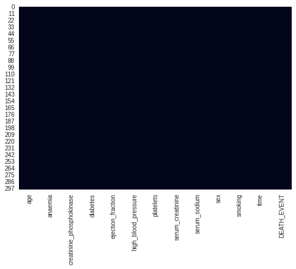
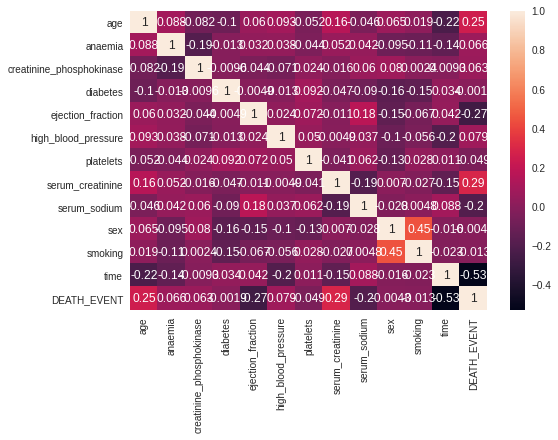
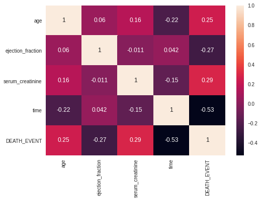
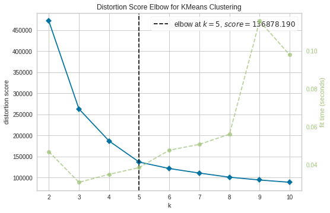
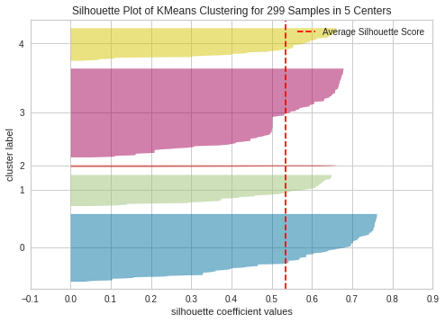
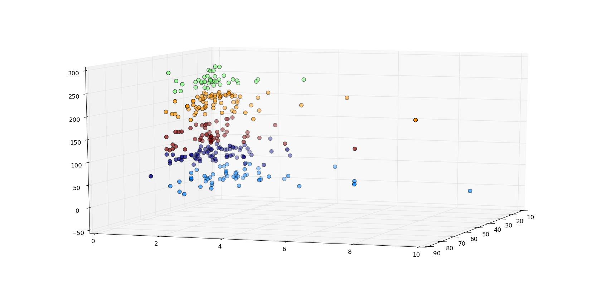

# Agrupamiento y análisis de grupos en personas con insuficiencia cardiaca

# Información de contacto
- José Vidal Cardona Rosas: vrosas832@gmail.com
- Brian Kalid García Olivo: briankalid2000@gmail.com

# Resumen 
En el presente documento se realizará un análisis de grupos haciendo uso del 
algoritmo de aprendizaje no supervisado, k-medios (k-means en inglés) para
determinar la razón y el por qué unas personas son más propensas al deceso
que otras. 

**keywords:** Data Mining, Clustering, K-means

# Descripción de los datos 
> Puedes interactuar con los datos en: https://share.streamlit.io/briankalid/contagiok_p

Los [datos](https://archive.ics.uci.edu/ml/datasets/Heart+failure+clinical+records#) a utilizar cuentan con 13 columnas
y con un total de 299 registros.

## Fuente
La versión original de los datos fue recopilada por:
  - Tanvir Ahmad
  - Assia Munir
  - Sajjad Haider Bhatti
  - Muhammad Aftab 
  - Muhammad Ali Raza
  
(Government College University, Faisalabad, Pakistán) y fueron puestos a disposición por las mismas personas en FigShare bajo
los derechos de autor *Attribution 4.0 International* (CC BY 4.0: libertad para compartir y adaptar el material)
en julio de 2017.

La versión actual de los datos fue elaborada por:
  - Davide Chicco (Instituto de Investigación Krembil, Toronto, Canadá)
Donada al Repositorio de Aprendizaje Automático de Irvine de la Universidad de California
bajo los mismos derechos de autor *Attribution 4.0 International (CC BY 4.0)*
en enero de 2020.

### Información de atributos
- **age:** edad del paciente (años)
- **anaemia:** disminución glóbulos rojos (booleana) 0=No tiene|1=Si tiene 
- **high blood pressure:** paciente con hipertensión (booleano) 0=No tiene|1=Sí tiene
- **creatinine phosphokinase (CPK):** nivel de la enzima CPK en sangre (mcg/L)
- **diabetes:** paciente con diabetes (booleano) 0=No tiene|1=Sí tiene
- **ejection fraction:** porcentaje de sangre que sale del corazón en cada contracción (porcentaje) 
- **platelets:** plaquetas en la sangre (kiloplaquetas/ml)
- **sex:** Mujer u Hombre 0=Mujer|1=Hombre 
- **serum creatinine:** nivel de creatinina sérica en sangre (mg/dl)
- **serum sodium:** nivel de sodio sérico en sangre (mEq/L)
- **smoking:** si el paciente fuma o no (booleano) 0=No fuma|1=Sí fuma
- **time:** período de seguimiento (días)
- **death event (target):** si el paciente falleció durante el período de seguimiento (booleano) 0=Sobrevivió|1=Murió

# Procesamiento de datos
## Detección de valores nulos
Una vez que los datos fueron analizados mediante un mapa de calor, se corroboró la inexistencia de valores nulos. 

> Mapa de calor para la detección de valores nulos.

## Filtrado de datos 
En un principio se procedió a la aplicación del algoritmo tras observar que no había datos nulos,
pero los resultados no nos dijeron mucho. Hablaremos más a fondo en la sección de
*descripción de experimentos*.
La idea para afrontar este problema surgió al detectar la variable de *diabetes*, es 
decir, estamos estudiando fallas de corazón ¿qué tanta importancia tiene la diabetes aquí? 
¿Y los demás valores? Por lo que se procedió a buscar una manera de evaluar
que parámetros aportaban más valor al análisis y cuales era preferible eliminar. A partir de 
esto, se opto por la obtención de una matriz de correlación, obteniendo los siguientes resultados:

> Cada cuadro contiene la correlación entre variables.
        
Para realizar el filtrado, nos hemos fijado en la correlación de cada variable con el 
*target event* que es DEATH_EVENT. Eligiendo sólo aquellas mayores o iguales
a +- 0.25 y eliminando el resto por debajo de ese valor.
Quedando al final las siguientes variables para trabajar: 
- Age
- Ejection Fraction
- Serum Creatinine
- Time
- DEATH_EVENT
Y la siguiente matriz de correlación para los datos de trabajo: 

> Cada cuadro contiene la correlación entre variables.

# Descripción de la tarea de aprendizaje no supervisado
Contamos con un conjunto de datos de múltiples personas que tuvieron insuficiencia cardiaca, 
dicho conjunto de datos describe a cada persona con múltiples estadísticas, por lo tanto se a procedido
a usar un algoritmo de clustering, específicamente el algoritmo **K-means**
para agrupar a estas personas por grupos, de tal manera que
podamos buscar similitudes en sus estadísticas de un grupo frente a otro y determinar cuales son más 
proclives a morir de insuficiencia cardiaca.
## Elección efectiva de un valor K
Se procedió a realizar la elección adecuada para el valor de *k*
haciendo uso del método **elbow** obteniendo el siguiente resultados:

> El cruce entre el número para k y la distorsión de puntaje determina el valor adecuado.

Podemos observar que el cruce se da en el valor 5 mismo en el que se 
tiene la menor distorsión para un valor bajo de k. 
Esto ya nos da un indicio de que el valor a tomar es 5. Para corroborar hemos hecho uso de **silhouette**:

> Los colores representan grupos.

Observamos que para un valor igual a 5 obtenemos grupos perfectamente separados. Por lo tanto
hemos de tomar k=5 para proceder a la implementación de k-means.

 > Visualización de los grupos formados por k-means.
        
# Descripción de experimentos
En un principio se realizo la formación de grupos con K-means al detectar la ausencia de valores nulos. 
Pero cuando se evaluaron los resultados, no nos dijeron mucho debido a que no había mucha distinción de un grupo a otro. 
Fue entonces cuando se planteo la idea de utilizar una matriz  de correlación para  justificar
la eliminación de algunas columnas.
    
Para poner en evidencia el contraste entre efectuar el uso de k-means cuando no se filtran columnas y cuando 
se filtran columnas, tomaremos los dos grupos de mayor probabilidad de muerte, tanto cuando se filtran columnas
como cuando no. En el caso de cuando no se filtran columnas, una vez que tomemos los dos grupos, quitaremos las columnas
que si filtramos en los otros datos. Esto pondrá en evidencia el problema sobre distinción de grupos.
Procediendo entonces, se obtuvieron los siguientes resultados para datos con **elección de columnas:**

- age & 66.696429
- ejection\_fraction & 36.232143
- serum\_creatinine  &1.860536
- time & 24.071429
- DEATH\_EVENT & 0.892857
> Valores obtenidos con elección de columnas a partir de la matriz de correlación, primer grupo 
con mayor probabilidad de muerte.

- age & 60.591549
- ejection\_fraction & 38.802817
- serum\_creatinine & 1.294789
- time & 79.619718
- DEATH\_EVENT & 0.309859
> Valores obtenidos con elección de columnas  a partir de la matriz de correlación, segundo
grupo con mayor probabilidad de muerte.

Ahora hacemos la comparativa contra las tablas **sin elección de columnas:**
 
- age & 60.818182
- ejection\_fraction & 36.509091
- serum\_creatinine & 1.492364
- time & 134.109091
- DEATH\_EVENT & 0.363636
> Valores obtenidos sin elección de columnas, primer grupo con mayor probabilidad de muerte.

- age & 60.518528
- ejection\_fraction & 38.611111
- serum\_creatinine & 1.517500
- time & 133.000000
- DEATH\_EVENT & 0.361111
> Valores obtenidos sin elección de columnas, segundo grupo con mayor probabilidad de muerte.

A partir de las tablas anteriores, podemos observar que no hay mucha distinción en los datos cuando
no se hace selección de columnas como para poder obtener conocimiento.  En cambio cuando hay
selección de columnas de trabajo a partir de la correlación con el *target event*, obtenemos una clara distinción
de los grupos. Esto justifica el uso de la matriz de correlación usada anteriormente para poder justificar la eliminación de algunas 
columnas en el procesamiento de los datos para trabajar.

# Análisis y discusión de resultados
Retomando nuestra elección para el valor de K y realizado la aplicación del algoritmo \textit{K-means} sobre los datos.
Hemos obtenido 5 grupos perfectamente diferenciables unos de otros que se presentan en las siguientes tablas:
    
 - age & 56.095238
 - ejection\_fraction & 38.380952
 - serum\_creatinine & 1.191190
 - time & 249.190476
 - DEATH\_EVENT & 0.047619
 > Cluster número 1 formado a partir de K-means.
 > * Edad promedio: 56 años
 > * Seguimiento promedio: 249 días
 > * Probabilidad de muerte: 4%
    
 - age & 60.031541
 - ejection\_fraction & 37.702703
 - serum\_creatinine & 1.372568
 - time & 196.932432
 - DEATH\_EVENT & 0.162162
 > Cluster número 2 formado a partir de K-means.
 > * Edad promedio: 60 años
 > * Seguimiento promedio: 196 días
 > * Probabilidad de muerte: 16%
 
 - age & 66.696429
 - ejection\_fraction & 36.232143
 - serum\_creatinine & 1.860536
 - time & 24.071429
 - DEATH\_EVENT & 0.892857
 > Cluster número 3 formado a partir de K-means.
 > * Edad promedio: 66 años
 > * Seguimiento promedio: 24 días
 > * Probabilidad de muerte: 89%
 
 - age & 59.892857
 - ejection\_fraction & 39.303571
 - serum\_creatinine & 1.233036
 - time & 123.357143
 - DEATH\_EVENT & 0.178571
 > Cluster número 4 formado a partir de K-means.
 > * Edad promedio: 59 años
 > * Seguimiento promedio: 123 días
 > * Probabilidad de muerte: 17%
 
 - age & 60.591549
 - ejection\_fraction & 38.802817
 - serum\_creatinine & 1.294789
 - time & 79.619718
 - DEATH\_EVENT & 0.309859
 > Cluster número 5 formado a partir de K-means.
 > * Edad promedio: 60 años
 > * Seguimiento promedio: 79 días
 > * Probabilidad de muerte: 30%
 
 
 A partir de los resultados anteriores podemos observar que se trata de personas de edad avanzada, comprendida entre
 55 y 66 años, con porcentajes de sangre que sale del corazón en cada contracción muy similares así como 
 un nivel de creatinina sérica en sangre también bastante similar. Lo que varía considerablemente de un grupo a otro son los datos 
 destacados: la **edad**, los **días de seguimiento** y la **probabilidad de muerte**.
 
 Si nos fijamos detenidamente en estos valores podemos darnos cuenta que las personas de edad avanzada que padecieron insuficiencia cardiaca
 requieren de un seguimiento prolongado para garantizar el no deceso tras la enfermedad. Es decir, las personas de edad avanzada que 
 padecieron insuficiencia cardíaca aumentan sus probabilidades de éxito al recibir un seguimiento prolongado,
 por otro lado si este seguimiento es demasiado pequeño, sus probabilidades de fallo aumentan bastante.
 
 A partir de los resultados, en el contexto del problema. Si fuésemos doctores, podríamos dar mayor y mejor seguimiento
 a este tipo de pacientes, pacientes con insuficiencia cardiaca, para garantizar su éxito tras la enfermedad. 
    
# Conclusión
En \cite{hf} así como en \cite{hf3_wiki} se hace mención sobre que 
la insuficiencia cardiaca es grave y usualmente no tiene cura pero se puede tratar con tratamiento y un cambio saludable en el estilo
de vida. Lo anterior nos ayudara a llevar el problema de una manera más placentera.

A partir de los resultados de nuestro trabajo podemos ofrecer como argumento el hecho de dar seguimiento a las personas, esto con 
la finalidad de aumentar sus probabilidades de éxito.
    
Algunas de las preguntas abiertas en el presente proyecto es sobre 
*¿cómo podemos corroborar que efectivamente las variables que filtramos no tienen mucho que ver en el problema?*
Así mismo, *¿existen otras variables que no fueron contempladas a la hora de formar el conjunto de datos?*

Una segunda parte para el proyecto probablemente consistiría en el estudio
de otras variables como la dieta de la personas, ya que como 
se menciona en \cite{hf2} una buena manera de prevenir la insuficiencia cardíaca es controlando las afecciones que la 
causan.

# Referencias
- hf 2017. What is Heart Failure? https://www.heart.org.
- hf3_wiki 2021. Heart failure. https://en.wikipedia.org/wiki/Heart_failure. 
- hf2 2020. Heart failure. https://www.mayoclinic.org.
